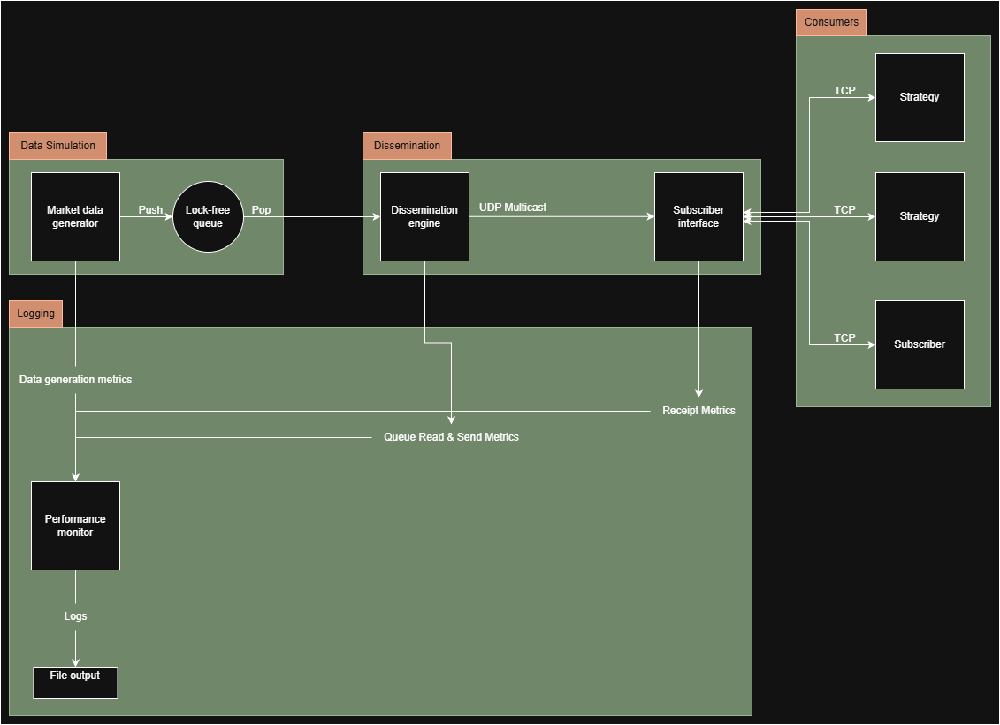

# Architecture of the Market Data Dissemination Simulator

## Overview
The Market Data Dissemination Simulator is a high-performance C++23 application designed to simulate low-latency market data dissemination. It comprises five components: Market Data Generator, Dissemination Engine, Subscriber Interface, Strategy and Performance Monitor.

## Architecture Diagram
The following diagram illustrates the system’s components and dataflow:

The Market Data Generator produces Quote and Trade structs, simulating exchange market data, and pushes them to a Boost.Lockfree queue for handoff to the Dissemination Engine. The Dissemination Engine broadcasts incremental updates (quotes and trades) via ZeroMQ UDP multicast to the Subscriber Interface, which manages TCP connections and delivers filtered data to subscribers (e.g., market-making or arbitrage strategies). Subscribers send subscription requests (e.g., "subscribe to AAPL") via ZeroMQ TCP to the Subscriber Interface, which forwards them to the Dissemination Engine. The Performance Monitor collects latency (primarily queue read to client receipt) and throughput metrics from the Dissemination Engine and Subscriber Interface, with optional metrics from the Generator for end-to-end analysis. Metrics are logged asynchronously using spdlog.

## Design Patterns
- **Producer-Consumer**:
  - **Use**: Market Data Generator produces Quote/Trade structs, consumed by the Dissemination Engine via a Boost.Lockfree queue.
  - **Rationale**: Enables thread-safe, low-latency data transfer. 
    - Note, however, that no locks does not lower latency. Lower latency comes from less contention. Try different queue types too. May not even need any locking, could just have the producer override a ring-buffer.
  - **Implementation**: Generator runs in a dedicated thread, pushing to a lock-free queue with capacity for 10K messages.

- **Publish-Subscribe**:
  - **Use**: Dissemination Engine publishes incremental updates via ZeroMQ UDP multicast; Subscriber Interface filters data based on TCP subscription requests.
  - **Rationale**: Decouples publishers and subscribers, supports dynamic filtering.
  - **Implementation**: ZeroMQ PUB/SUB sockets for multicast; ZMQ TCP-based subscription manager. 

- **Observer**:
  - **Use**: Performance Monitor observes Dissemination Engine and Subscriber Interface for latency and throughput metris. Generator monitoring is optional.
  - **Rationale**: Non-intrusive metric collection preserves hot-path performance; modular for adding new metrics.
  - **Implementation**: Callbacks via `IMonitor` interface; asynchronous logging with spdlog.
    - Note: Ideally, do not want any runtime polymorphism in the hot-path. See if we can do this differently. 

## Module Interactions
| Module                | Input                                              | Output                                         | Interaction Details                                                                                                  |
|-----------------------|----------------------------------------------------|------------------------------------------------|----------------------------------------------------------------------------------------------------------------------|
| Market Data Generator | Config (rate, symbols)                             | Quote/Trade structs, optional metrics          | Pushes structs to Boost.Lockfree queue; optionally sends generation rate to Monitor.                                 |
| Dissemination Engine  | Structs from queue, subscription requests          | Multicast incremental updates, latency metrics | Reads queue; broadcasts via ZeroMQ UDP; sends queue read/send timestamps to Monitor.                                 |
| Subscriber Interface  | Multicast updates, client subscriptions            | Filtered updates to clients, receipt metrics   | Receives multicast; sends filtered updates to clients via TCP; sends receipt timestamps to Monitor.                  |
| Strategy (Clients)    | Filtered update via TCP                            | out of scope                                   | Sends request for symbol via TCP to subscriber interface; validates data; no actual strategy or feedback to exchange |
| Performance Monitor   | Metrics from Engine, Interface, optional Generator | Log file                                       | Collects latency (dissemination-to-subscriber, optional end-to-end) and throughput; logs asynchronously.             |

## Implementation Notes
- **Low-Latency**:
  - Boost.Lockfree queue to try out. Later experiement with ringbuffer.
  - No dynamic allocations in hot paths; fixed-size message structs.
- **Performance Monitoring**:
  - Primary focus: Dissemination-to-subscriber latency (queue read to client receipt).
  - Timestamps captured at queue read, multicast send, and client receipt using `std::chrono::high_resolution_clock`.
  - Throughput measured as messages processed per second.
  - Asynchronous logging with spdlog minimizes overhead; batch logging every 1000 messages or 1s.
  - Optional generator metrics (e.g., message rate) for testing pipeline performance.
- **Subscriptions**:
  - Clients connect to Subscriber Interface via ZeroMQ TCP SUB sockets.
  - Subscription requests (e.g., "subscribe to AAPL") forwarded to Dissemination Engine via TCP REQ/REP.
  - Subscriber Interface filters multicast messages based on subscriptions.
  - Unsubscription follows the same TCP path, stopping filtered updates.
- **Extensibility**:
  - Performance Monitor can add metrics (e.g., latency jitter).
- **Modularity**:
  - Modules implement interfaces (e.g., `IGenerator`, `IMonitor`) for testability.
  - Components are independently testable, with Google Test. 